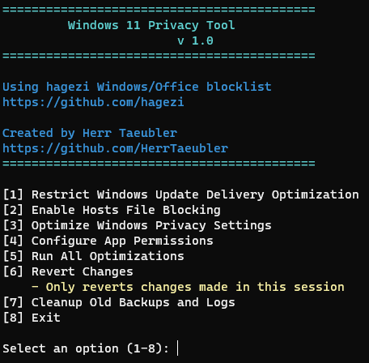

# Windows 11 Privacy Optimizer v 1.2.0   


A comprehensive PowerShell script to enhance and manage privacy settings in Windows 11, providing a balanced approach between privacy and functionality.

## Features

### Core Functions
- 🛡️ Windows Privacy Settings Optimization
- 🌐 Telemetry and Tracking Domain Blocking (using hagezi's blocklist)
- 📦 Windows Update Delivery Optimization
- 📱 App Permissions Management
- 🔄 Cleanup of Backups and Logs

### Key Benefits
- 🔒 Enhanced Privacy Controls
- 💻 System Stability Focus
- 📊 Detailed Logging
- ⚡ Easy to Use Interface
- 🔄 Reversible Changes

## 📸 Preview



## Quick Start

### Installation
Open PowerShell as administrator and run:

```irm https://raw.githubusercontent.com/minzi90/Win11-privacy-tool/main/Win11-privacy-tool.ps1 | iex```

### Requirements
- Windows 11
- PowerShell 5.1 or higher
- Administrator rights

## Detailed Features

### Privacy Settings Management
- Telemetry and data collection controls
- Windows Search privacy enhancement
- Cloud sync restrictions
- Windows Hello privacy settings
- Activity history management
- Feedback and diagnostics controls
- Content delivery management

### App Permissions Control
- Camera and microphone access
- Location services
- Contact and calendar access
- File system permissions
- Background app management
- Notification controls

### Network Privacy
- Update delivery optimization
- DNS blocking via hosts file
- Network location awareness
- Cloud content restrictions

### Security & Backup
- Automatic backup creation
- System Restore Point option
- Registry change tracking
- Easy restoration process

## Compatibility

Optimized for Windows 11 24H2

## Credits

- Using [hagezi's Windows/Office blocklist](https://github.com/hagezi)
- Community contributions and feedback

## License

MIT License - See LICENSE file for details

## Author

Herr Täubler

## Disclaimer

While this tool is designed to be safe and reversible, use it at your own risk. Always ensure you have proper backups before making system changes.

## Support

For issues, questions, or suggestions:
- Open an issue on GitHub
- Submit a pull request
- Contact via GitHub
